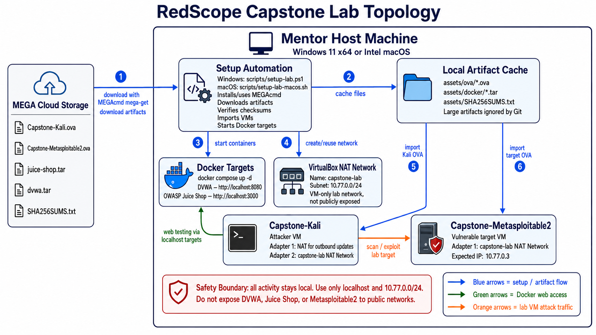

# Lab Topology

This lab uses a small hybrid layout:

- Windows host
- Docker containers for DVWA and Juice Shop
- Kali VM as the attacker machine
- Metasploitable 2 VM as the vulnerable target
- `scripts/setup-lab.ps1` as the reproducible setup layer

## Network diagram

## Setup and traffic flow

1. The mentor runs `scripts/setup-lab.ps1` on Windows or `scripts/setup-lab-macos.sh` on Intel macOS.
2. The script uses MEGAcmd `mega-get` to download the OVA, Docker archive, and checksum artifacts from MEGA if they are not already cached locally.
3. Docker Compose starts the web targets on the mentor host:
   - DVWA: `http://localhost:8080`
   - OWASP Juice Shop: `http://localhost:3000`
4. VirtualBox creates or reuses the `capstone-lab` NAT Network for VM-only lab traffic.
5. `Capstone-Kali` is the attacker VM. It uses NAT for outbound access and `capstone-lab` for lab traffic.
6. `Capstone-Metasploitable2` is the vulnerable network target VM on `capstone-lab`, expected at `10.77.0.3`.

## Address plan

- DVWA: `localhost:8080`
- Juice Shop: `localhost:3000`
- Kali lab subnet: `10.77.0.0/24`
- Metasploitable 2: `10.77.0.3`

## Design choice

The Docker services are the small, reusable part of the lab.
The VMs are the heavier local state and should only be removed after approval.
The exported OVAs are ignored by Git and should be distributed through cloud storage.
