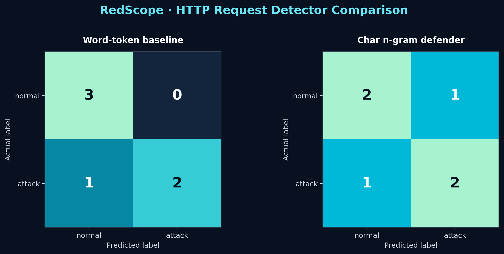

# RedScope Adversarial ML Detector Report

**Generated:** 2026-07-23T21:25:49+05:30  
**Timezone:** `Asia/Kolkata`  
**Dataset:** `sample_requests.csv`  
**Scope:** Lab-only demonstration

## Executive Summary

The word-token baseline and character n-gram defender were trained on the same stratified split. The character model detected more of the deliberately modified attack inputs, while its test-set behavior shows that stronger evasion resistance can still introduce tradeoffs.

## Dataset and Method

- Samples: **20**
- Normal requests: **10**
- Attack requests: **10**
- Train/test split: **70/30**
- Random state: **7**
- Classifier: **Logistic Regression**

## Performance Summary

| Model | Accuracy | Attack precision | Attack recall | Attack F1 |
|---|---:|---:|---:|---:|
| Word-token baseline | 83.33% | 100.00% | 66.67% | 80.00% |
| Char n-gram defender | 66.67% | 66.67% | 66.67% | 66.67% |

## Confusion Matrices

### Word-token baseline

| Actual \ Predicted | Normal | Attack |
|---|---:|---:|
| Normal | 3 | 0 |
| Attack | 1 | 2 |

### Char n-gram defender

| Actual \ Predicted | Normal | Attack |
|---|---:|---:|
| Normal | 2 | 1 |
| Attack | 1 | 2 |

## Evasion Results

| ID | Technique | Word baseline | Char defender |
|---|---|---|---|
| EV-01 | URL-encoded SQL injection | attack (54.4% attack probability) | attack (54.3% attack probability) |
| EV-02 | Inline-comment SQL injection | attack (59.9% attack probability) | attack (56.8% attack probability) |
| EV-03 | Mixed-case SQL injection | attack (59.9% attack probability) | attack (59.6% attack probability) |
| EV-04 | URL-encoded XSS | normal (43.8% attack probability) | attack (50.1% attack probability) |

## Observed Errors

### Word-token baseline

**False negatives**

- `GET /?q= HTTP/1.1`

- False positives: none

### Char n-gram defender

**False negatives**

- `GET /product?id=1; DROP TABLE users;-- HTTP/1.1`

**False positives**

- `POST /contact name=Alice&message=hello`

## Interpretation

- The word-token baseline missed **1 of 4** adversarial samples.
- The character n-gram defender missed **0 of 4** adversarial samples.
- Character n-grams retain punctuation and local character patterns that the baseline token pattern discards, which can improve detection of encoded or reformatted payloads.
- Results are highly sensitive to the tiny dataset. Accuracy and evasion resistance here should be treated as demonstration evidence, not production performance.

## Recommended Production Improvements

1. Decode and canonicalize URL/body data before feature extraction.
2. Train on more representative normal and malicious traffic.
3. Test multiple encodings and nested/double-encoding cases.
4. Tune thresholds using environment-specific false-positive costs.
5. Combine ML output with deterministic WAF/rule-based detections.
6. Monitor drift and revalidate after model or application changes.

## Reproducibility

- Python: `3.12.13`
- pandas: `2.2.3`
- scikit-learn: `1.8.0`

> Authorized lab use only. Do not test payloads against systems you do not own or have explicit permission to assess.
